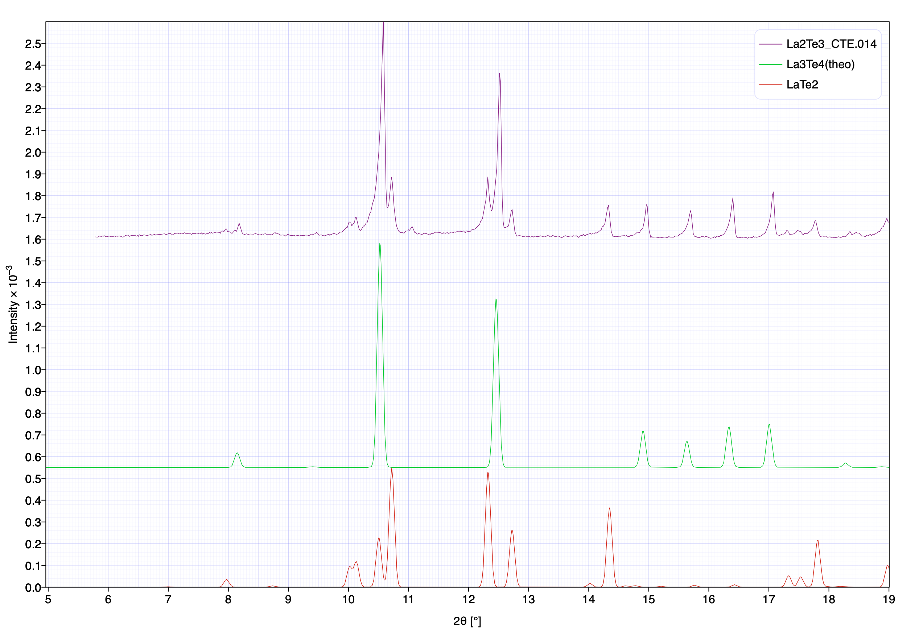
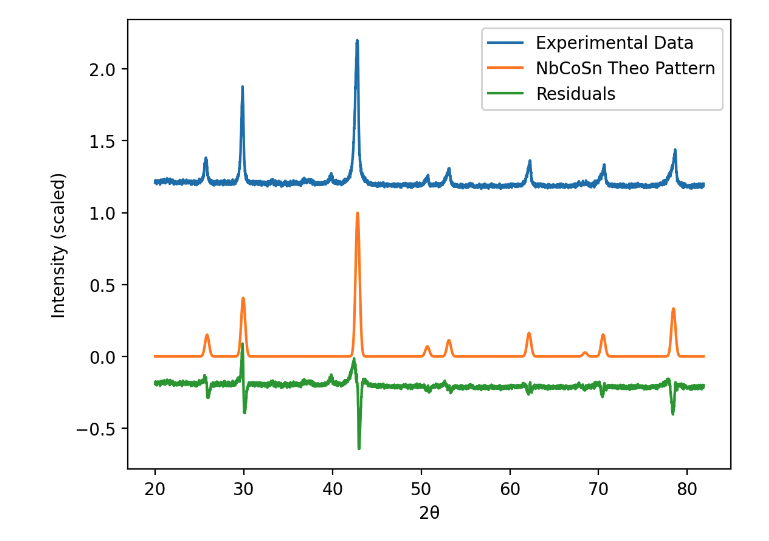

# Data Engineering Project Proposal

### XRD Analysis (x-ray diffraction to determine a material's phase)

### Abstract: 

Herein I detail a powder X-ray diffraction tool I built using material projects database and streamlit as the user interface. X-ray diffraction or xrd is a common tool used by many in the solid state chemistry and material science communities to characterize materials. One of the simplest characterization tasks performed is identifying what phase a material is. Here I leverage material projects open database of material properties to build a tool that can determine the phase identity of a material based on its powder X-ray diffraction pattern. While this is not the first time this type of software has been developed it is the first, to my knowledge, that phase identification is freely available and runs in a web browser.

### Design:

The first ever Nobel prize in physics in 1901 was given Rontgen for the discovery of X-rays. Subsequent prizes were given to Laue in 1914 for the discovery of diffraction in crystals and 1915 to the Bragg father son duo for their use of diffraction to determine a crystal's structure. Today X-ray diffraction is used in a variety of ways to learn about a material's structure. One very common and simple analysis often performed is a phase a purity analysis that looks at an unknown substance and by using X-ray diffraction can determine what the substance is. There are numerous software that can perform this analysis such as crystal diffract http://crystalmaker.com/crystaldiffract/index.html and Match! https://www.crystalimpact.com/match/sales.htm.

 Besides the expense of these programs, a downside both programs have is their limited library of compounds to compare the tested material with. In the case of crystal diffract scientists must get reference patterns from another source and with Match! the reference patterns must be purchased at an additional cost, and requires additional purchases to update as new materials are discovered. A potential source for these reference patterns is The Material's Project, https://materialsproject.org/api which is an open-access database offering material properties including theoretical X-ray diffraction patterns. Herein I build a new x-ray analysis tool that based on a users input for possible elements in the unknown sample, can query the nearly 150 K known materials in materials project's database. The intended user of this tool will be scientists and engineers who want a faster and cheaper way to determine what their unknown material is. 

### Data:

Bellow is an example of  what powder x-ray diffraction data looks like using crystal diffract to plot the results.

Rather than having the user download and gather all the possible x-ray theoretical patterns and then compare them to a measurement using an expensive plotting software, I import the theoretical patterns directly from materials project into a web app for users to compare against their sample. 

Below is an example of what the streamlit x-ray app can create:

Data Pipeline:

* User inputs
  * X-ray diffraction pattern
  * List of possible elements
* Data Ingestion:
  * Query's Material's Projects database for all possible compounds made of those elements. 
* Data Storage/Processing:
  * Currently I can run everything on the basic computing power/ram that streamlit provides. 
* Deployment:
  * Streamlit app that the user input their data to begin with

### Algorithm:

The algorithm for this analysis is incredibly simple, however there is a fair amount of data manipulation done on the user data and material projects data before the simple sum of differences squared is taken. The data that I get from materials project is a list of peaks along with their relative intensity to each other. In the streamlit code, there is a function that takes this input and using a normal distribution generator creates the theoretical pattern seen above. The 2-theta interval in which the intensity is calculated is based on the two-theta interval that the user's data was taken by. A final data manipulation I had to do was to subtract out the background noise radiation the user data input. This is accomplished by taking the median value of the measurement data and subtracting it from all data points. After this I simply subtract the measurement matrix from the theoretical pattern matrixes and sum the squares to determine which of the returned patterns is the best fit.

### Tools:

* Streamlit for user inputs and deployment
* Numpy and pandas for Data manipulation
* Materials Projects API to query materials
* MongoDB commands used within Material Project's API

### Communication:

* Streamlit App
* Powerpoint Presentation
